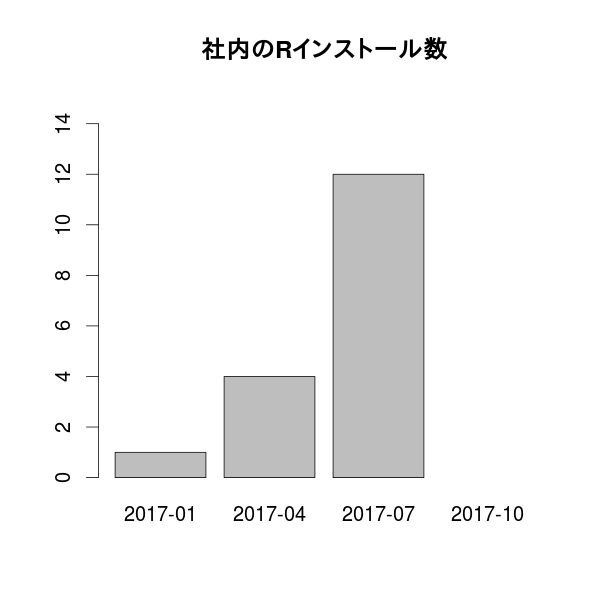
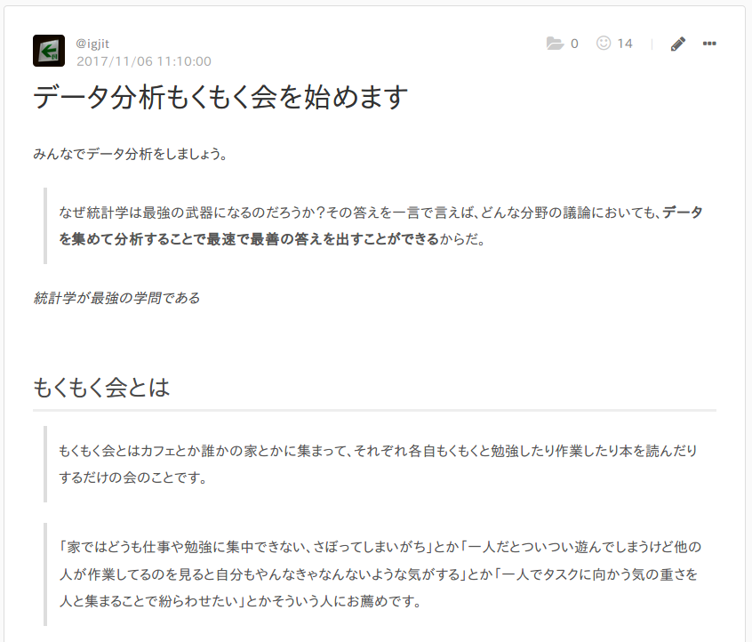

# 私の仕事

---

Webアプリケーションエンジニア

---

Webサービス作ってます

---

仕事で使う言語

# Ruby

---

ビジネスサイドが使う分析ツール

# Google<br>スプレッドシート

---

社内のRユーザー

# 私だけ

---


---

趣味で

---

第39回 TokyoR

<iframe src="//www.slideshare.net/slideshow/embed_code/key/3HbfBlZBCllo4y" width="595" height="485" frameborder="0" marginwidth="0" marginheight="0" scrolling="no" style="border:1px solid #CCC; border-width:1px; margin-bottom:5px; max-width: 100%;" allowfullscreen> </iframe>

---

社内のRユーザーを増やすためにやったこと

# 1. 自社サービスでRを使う

---

自社サービスにレコメンデーションを実装したい

---

10章 k近傍法：推薦システム


---

## in R

---

Rubyから雑にRを呼び出す

---

Ruby

```ruby
# rubyの子プロセスとしてRscriptを呼び出す
result = `Rscript foo.R data.csv`
raise 'Rscript failed' if $CHILD_STATUS != 0

# Rscriptで標準出力に吐いた結果をparseする
CSV.parse(result, headers: true)
```

R

```r
args = commandArgs(trailingOnly = TRUE)
csv.file = args[1]

df <- read.csv(csv.file, header = TRUE)

## 何かやる
out.df <- do.something(df)

write.csv(out.df)
```

---

Rのコードを書いたけど

---

マージには最低2人のコードレビューが必要

---

同僚にRのコードをレビューをしてもらうために

---


---

周りのエンジニアをRユーザーにした

---


---

非エンジニアもRユーザーにしたい

# 2. 社内勉強会を開く


---


---

## in R

---

### マンガでわかる統計学 in R

[igjit/manga-statistics-r](https://github.com/igjit/manga-statistics-r)

---

非エンジニアもRを使い始めた

- デザイナー
- ライター
- セールス
- カスタマーサクセス
- コーポレートデザイン

---



---

でもアクティブユーザーは

---


# 私だけ

---

みんながRを使う機会を作ろう

# 3. もくもく会を開く

---



---

週1回定時後に集まって

---


---

各自好きなことやってます

- [Rによるやさしい統計学](http://shop.ohmsha.co.jp/shopdetail/000000001781/)読む
- [みどり本](https://www.iwanami.co.jp/book/b257893.html)読む
- [Kaggleのチュートリアル](http://trevorstephens.com/kaggle-titanic-tutorial/getting-started-with-r/)やる

---


---

今後も地道にユーザーを増やしていきます。

---

ご意見ください。


[\@igjit](https://twitter.com/igjit)
