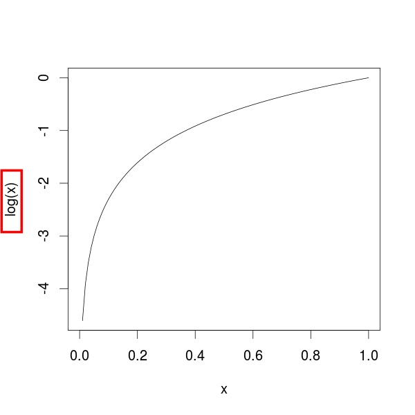
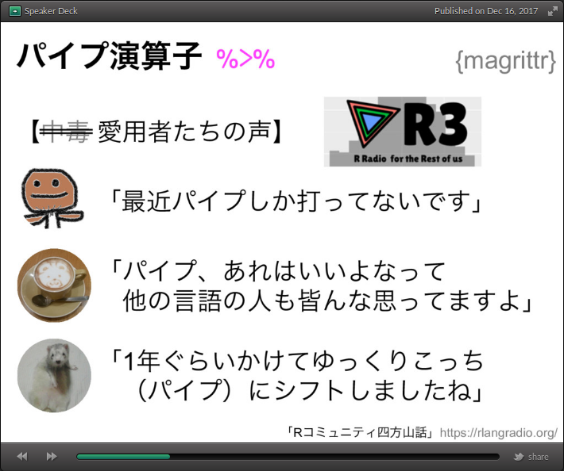
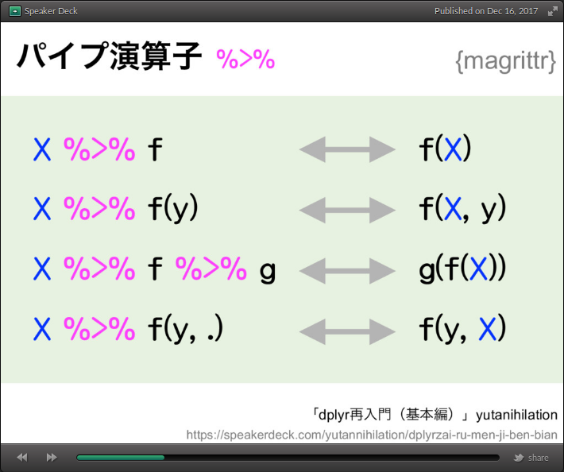

[\@igjit](https://twitter.com/igjit)

- Webアプリケーションエンジニア
- ときどきデータ分析
- [社内のRユーザーを増やしている](https://igjit.github.io/slides/2017/12/r_users)

---

いくつかのプログラミング言語を使ってきたけど

---

## Rはすごく不思議な言語

---

```r
x
# エラー:  オブジェクト 'x' がありません

log(x)
# エラー:  オブジェクト 'x' がありません

curve(log(x))  # これはok
```

---



---

```r
ggplot2
# エラー:  オブジェクト 'ggplot2' がありません

library(ggplot2)  # これはok
```

---

前回

Tokyo.R #66

---

[66th Tokyo.R Beginner session2 by kilometer](https://speakerdeck.com/kilometer/66th-tokyo-dot-r-beginner-session2)



---

[66th Tokyo.R Beginner session2 by kilometer](https://speakerdeck.com/kilometer/66th-tokyo-dot-r-beginner-session2)



---

私の感想

---

## これどうやって実装されてるんだろう。

---

渡したコードの意味が変わっている

- 引数が先頭に追加される
- プレースホルダー (`.`)

---

このセッションの目標

---

R言語について知る

- 演算子
- 遅延評価
- NSE
- メタプログラミング

---

そして

## 自分でパイプ演算子を実装してみる

# 1. 演算子

---

中置演算子

```r
1 + 2
```

関数呼び出し

```r
sum(1, 2)
```

---

実は

## R内で起きることすべては関数呼び出しである。

---

これは

```r
1 + 2
```

<div class="fragment">
これと等価

```r
`+`(1, 2)
```
</div>

---

これは

```r
1:10
```

<div class="fragment">
これと等価

```r
`:`(1, 10)
```
</div>

---

なのでこれは

```r
a %>% b
```

<div class="fragment">
これと等価

```r
`%>%`(a, b)
```
</div>

---

演算子を定義する

```r
`%add%` <- function(a, b) {
    a + b
}
```
<div class="fragment">
```r
1 %add% 2
# [1] 3
```
</div>

---

ここまでの知識で

## パイプ演算子を実装してみよう

---

これは

```r
a %>% b
```

<div class="fragment">
こういうことなので

```r
b(a)
```
</div>

---

こう実装できる

```r
`%pipe%` <- function(a, b) {
    b(a)
}
```

---

動いた

```r
1:10 %pipe% sum
# [1] 55
```

<div class="fragment">
chainもできる

```r
1:10 %pipe% log %pipe% plot
```
</div>

---

でも右辺が関数呼び出しだとだめ

```r
1:10 %pipe% sum()  # エラー
```

---

もう少し知識が必要

# 2. 遅延評価

---

Rの関数では

## 引数は遅延評価される

<div class="fragment">
つまり

## 引数が使われた場合に初めて評価される
</div>

---

```r
f <- function(a, b) {
    if (a > 0) b
}
```

<div class="fragment">
```r
f(1, stop("This is an error!"))
# f(1, stop("This is an error!")) でエラー (#1 から) : This is an error!

f(0, stop("This is an error!"))  # 何も起きない
```
</div>

# 3. 非標準評価

---

```r
curve(log(x))
```


---

Rの関数は、引数の値だけでなく

## 引数を計算するコードを参照できる

---

この引数を計算するコードを利用する評価方法が

## 非標準評価

NSE (Non-standard evaluation)

---

`substitute()` で表現式を捕捉できる

```r
f <- function(x) {
    substitute(x)
}
```

```r
f(1 + 2)
# 1 + 2
```
---

`quote()` でも表現式を捕捉できる

```r
quote(1 + 2)
# 1 + 2
```

---

ただし関数内での挙動が違う

```r
f <- function(x) {
    substitute(x)
}

f(1 + 2)
# 1 + 2
```

```r
f <- function(x) {
    quote(x)
}

f(1 + 2)
# x
```

---

`eval()` で表現式を評価できる

```r
quote(1 + 2)
# 1 + 2

eval(quote(1 + 2))
# [1] 3
```

---

`eval()` の第2引数で環境を指定できる

```r
e <- new.env()
e$x <- 40

eval(quote(x + 2), e)
# [1] 42
```

# 4. メタプログラミング

---

`quote()` は表現式を返す

```r
quote(1 + 2)
# 1 + 2
```

---

表現式は

## 木構造

abstract syntax tree (AST) とも呼ばれる

---

`pryr::ast()` で木構造を見ることができる

```r
ast(1 + 2 * 3)
# \- ()
#   \- `+
#   \-  1
#   \- ()
#     \- `*
#     \-  2
#     \-  3 
```

---

表現式はlistのように扱える

```r
expr <- quote(1 + 2)

as.list(expr)
# [[1]]
# `+`
# 
# [[2]]
# [1] 1
# 
# [[3]]
# [1] 2

expr[[1]]
# `+`
```

---

表現式は修正できる

```r
expr <- quote(1 + 2)
expr[[1]] <-  quote(`*`)

expr
# 1 * 2
```

---

ということは

---

### コードの意味を変えることができる

```r
f <- function(x) {
    expr <- substitute(x)
    expr[[1]] <- quote(`*`)  # 関数名を差し替える
    eval(expr)
}
```

```r
3 + 4
# [1] 7

f(3 + 4)
# [1] 12

f(3 > 4)
# [1] 12
```

---

構文木を読み書きする

## メタプログラミング

---

もういちどパイプ演算子を実装してみよう

---

`x %>% f(y)` が `f(x, y)` と等価

`f` の引数の先頭に `x` を追加すれば良い

---

バージョン2

```r
`%pipe2%` <- function(lhs, rhs) {
    env <- parent.frame()  # 関数の呼び出し環境
    expr <- substitute(rhs)
    eval(as.call(c(expr[[1]],
                   substitute(lhs),
                   as.list(expr[-1]))),
         env)
}
```

---

動いた

```r
1:10 %pipe2% head(n = 3)
# [1] 1 2 3
```

---

でもプレースホルダー (`.`) に対応していない

```r
1:10 %pipe2% head(.)  # エラー
```

---

もう少しがんばる

---

表現式がドットを含むかどうか確認する補助関数

```r
has_dot <- function(expr) {
    any(vapply(expr, identical, logical(1), quote(.)))
}
```

```r
has_dot(quote(1 + 2))
# [1] FALSE

has_dot(quote(1 + .))
# [1] TRUE
```

---

引数の先頭にドットを追加する補助関数

```r
insert_dot <- function(expr) {
    as.call(c(expr[[1]], quote(.), as.list(expr[-1])))
}
```

```r
insert_dot(quote(head(n = 3)))
# head(., n = 3)
```

---

バージョン3

```r
`%pipe3%` <- function(lhs, rhs) {
    env <- parent.frame()
    expr <- substitute(rhs)
    dotted <- if (has_dot(expr)) expr else insert_dot(expr)
    eval(dotted, list(. = lhs), env)
}
```

---

右辺にドットがあってもなくても動く

```r
1:10 %pipe3% head(.)
# [1] 1 2 3 4 5 6

1:10 %pipe3% head(n = 3)
# [1] 1 2 3
```

---

## 楽しい！

---

ちなみに本物のパイプ演算子を使いたい場合は

```r
library(magrittr)
```

---

`magrittr`のソースコード読むと楽しいよ。

<https://github.com/tidyverse/magrittr>

# 参考文献

---

{height="600px"}

---

- 私が今まで読んだ中で最高のRの本
- 本当に徹底解説
- 興味深い話題
    - 環境オブジェクト
    - 関数型プログラミング
    - DSL
    - コードの最適化

---

## Enjoy!
