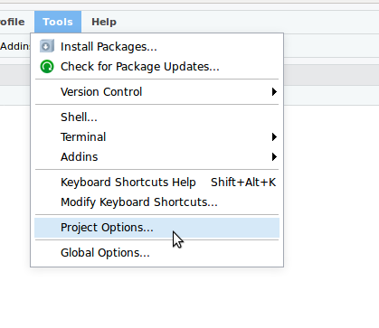
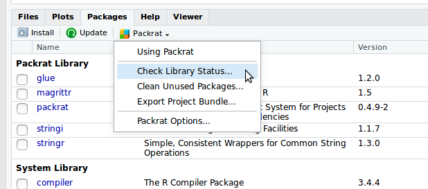
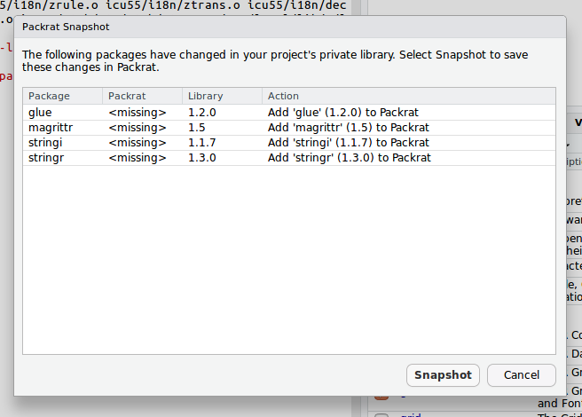

あなたの書いたRのコード

---

## PC買い換えたら<br/>動かなくなるかも

---

## 他の人のPCで実行したら<br/>挙動が変わってしまうかも

---

原因はいろいろあるけど特に

<div class="fragment">
## パッケージ
</div>

---

## パッケージのバージョンは?

<div class="fragment">
install.packages をいつ実行したかでパッケージのバージョン変わる
</div>

<div class="fragment">
非互換の変更があると挙動が変わったり動かなくなったりする可能性がある
</div>

---

Rのコードだけでなく

<div class="fragment">
パッケージのバージョンも<br/>管理しよう。
</div>

---

## [Packrat](https://rstudio.github.io/packrat/)

RStudio製のパッケージ管理システム

---

## パッケージ管理を始める

---

Rのコードを書いたら

```r
library(dplyr)

starwars %>%
    mutate(name, bmi = mass / ((height / 100)  ^ 2)) %>%
    select(name:mass, bmi)
```

---

`packrat::init()` でPackratプロジェクトを初期化

```r
> packrat::init()
```

---

すると必要なパッケージが**プロジェクト内** (`packrat/lib/`) にインストールされて

---

パッケージのバージョンが `packrat/packrat.lock` に記録される。

```
PackratFormat: 1.4
PackratVersion: 0.4.9.1
RVersion: 3.4.4
Repos: CRAN=https://cran.ism.ac.jp

(略)

Package: dplyr
Source: CRAN
Version: 0.7.4
Hash: cf677ec8dad7a45d1397dd7e72ef30c6
Requires: BH, R6, Rcpp, assertthat, bindrcpp, glue, magrittr,
    pkgconfig, plogr, rlang, tibble

Package: glue
Source: CRAN
Version: 1.2.0
Hash: 381e42baedecc633c0e547a0c7ca9de7

(略)
```

---

以降は**プロジェクト内**にインストールされたライブラリを使うようになる。

```r
> .libPaths()
[1] "/home/igjit/sample_proj/packrat/lib/x86_64-pc-linux-gnu/3.4.4"    
[2] "/home/igjit/sample_proj/packrat/lib-ext/x86_64-pc-linux-gnu/3.4.4"
[3] "/home/igjit/sample_proj/packrat/lib-R/x86_64-pc-linux-gnu/3.4.4"  
```

---

パッケージを追加でインストール

```r
> install.packages("stringr")
 パッケージを ‘/home/igjit/sample_proj/packrat/lib/x86_64-pc-linux-gnu/3.4.4’ 中にインストールします 
 (‘lib’ が指定されていないため) 
 依存対象 (dependency) ‘stringi’ もインストールします 

 :
```

---

`packrat::status()` で現状を確認

```r
> packrat::status()

The following packages have been updated in your library, but have not been recorded in packrat:
              library   packrat
    stringi     1.1.7        NA
    stringr     1.3.0        NA

Use packrat::snapshot() to record these packages in packrat.
> 
```

これらはまだPackratで管理されていない。

---

`packrat::snapshot()` でスナップショット取得

```r
> packrat::snapshot()

Adding these packages to packrat:
            _      
    stringi   1.1.7
    stringr   1.3.0

Snapshot written to '/home/igjit/sample_proj/packrat/packrat.lock'
> 
```

プロジェクトで使うバージョンが固定される。

---

## 簡単

---

## パッケージの復元

---

別の環境でパッケージを復元する

---

別のPCにプロジェクトのディレクトリを持ってくる

(gitを使っている場合)

```
$ git clone path/to/sample_proj
```

---

Rを起動するだけでPackratが自動でインストールされる

```
$ cd sample_proj/
$ R -q
Packrat is not installed in the local library -- attempting to bootstrap an installation...
> Installing packrat into project private library:
- 'packrat/lib/x86_64-pc-linux-gnu/3.4.4'
* installing *source* package ‘packrat’ ...
**  パッケージ ‘packrat’ の解凍および MD5 サムの検証に成功しました 
** R
** inst
** preparing package for lazy loading
** help
*** installing help indices
** building package indices
** testing if installed package can be loaded
* DONE (packrat)
> Attaching packrat
> Restoring library
> Packrat bootstrap successfully completed. Entering packrat mode...
Packrat mode on. Using library in directory:
- "~/sample_proj/packrat/lib"
> 
```

---

`packrat::restore()` で全く同じバージョンのパッケージがインストールされる

```r
> packrat::restore()
Installing BH (1.66.0-1) ... 
	OK (built source)
 :
Installing tibble (1.4.2) ... 
	OK (built source)
Installing dplyr (0.7.4) ... 
	OK (built source)
> 
```

---

## 簡単

---

## RStudioで使う

---

Tools > Project Options



---

選択


---

Packages pane で Packrat > Check Library Status



---

Snapshotを取得



---

プロジェクトで使うバージョンが固定される。


---

## 簡単

---

## デプロイ

---

Rコンソールを立ち上げずに非対話でパッケージを配置する方法

---

`.Rprofile` に CRANミラーを追記しておいて

```r
options(repos = c(CRAN = "http://cloud.r-project.org/"))  # 追記

#### -- Packrat Autoloader (version 0.4.9-1) -- ####
source("packrat/init.R")
#### -- End Packrat Autoloader -- ####
```

---

コマンド実行

```sh
R --vanilla --slave -f .Rprofile --args --bootstrap-packrat &&
  Rscript --no-save --no-restore --no-site-file --no-environ -e 'packrat::restore()'
```

---

(もっと良いやり方あったら教えてください。)

---

## 参考

---

公式ページ

<https://rstudio.github.io/packrat/>

---

## まとめ

---

## パッケージ管理

---

いつどこで実行しても同じ結果になるように

---

## Enjoy!
