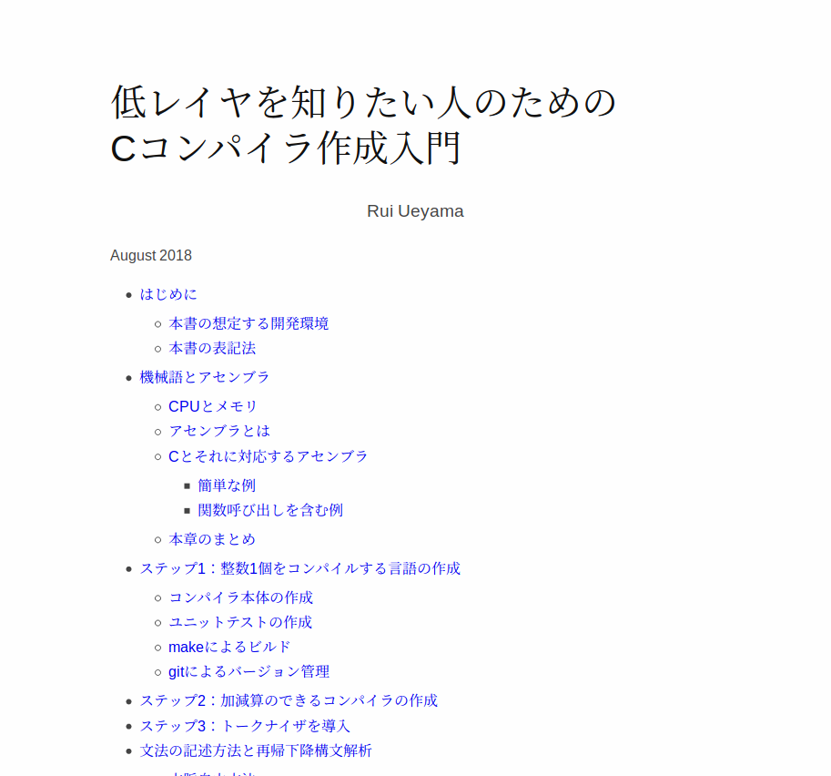
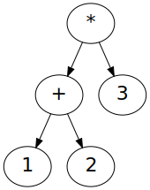
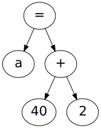
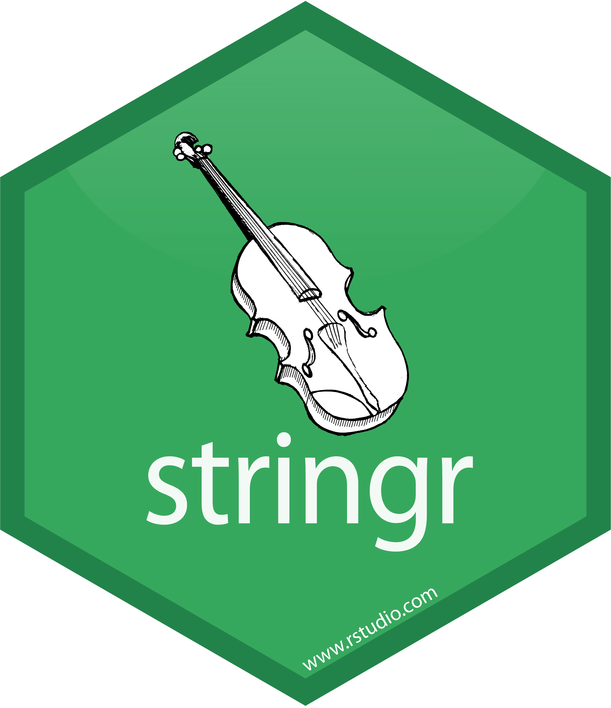

きっかけ

---

<p class="text-small">
<https://www.sigbus.info/compilerbook/>
</p>



---

コンパイラ作るのってすごく難しそうなイメージだったけど

---

Cのソースコードを

```c
int main() {
  return 42;
}
```

<div class="fragment">
x86-64アセンブリに変換する

```
.intel_syntax noprefix
.global main
main:
        mov rax, 42
        ret
```

<p class="text-small">
(アセンブリから実行ファイルの変換はGCCでやる)
</p>
</div>

---

文字列を読んで文字列を書ければコンパイラは作れる

---

## じゃあRでもできるんじゃね？

---

どの言語でどの言語のコンパイラを書いても良いはず

---

ならば

## RでRのコンパイラを書いてみよう。

---

やってみた。

---

## nrc

<https://github.com/igjit/nrc>

---

インストール

```r
devtools::install_github("igjit/nrc")
```

<div class="text-small">
(現在Linuxにしか対応してないので他のOSの場合はDockerとか使ってください。)
</div>

---

# あそびかた

---

packageを読み込むと

```r
> library(nrc)
```

---

Rのコードをコンパイルできる

```r
> compile("1+2")
.intel_syntax noprefix
.global main
main:
  push rbp
  mov rbp, rsp
  sub rsp, 208
  push 1
  push 2
  pop rdi
  pop rax
  add rax, rdi
  push rax
  pop rax
  mov rsp, rbp
  pop rbp
  ret
```

---

コンパイルしてアセンブル

```r
> compile("1+2") %>% assemble
[1] "/tmp/RtmpW7m1KT/file760c7d79428b"
```

<p class="text-small">
実行ファイルが出力される
</p>

---

コンパイルしてアセンブルして実行

```r
> compile("1+2") %>% assemble %>% execute
[1] 3
```

---

変数も使える

```r
> "a <- 2; a + 40" %>% compile %>% assemble %>% execute
[1] 42
```

<div class="fragment">
代入演算子は `<-` (今のところ唯一のRっぽさ)
</div>

---

テキストの [ステップ6: ==と!=を追加する](https://www.sigbus.info/compilerbook/#%E3%82%B9%E3%83%86%E3%83%83%E3%83%976-%E3%81%A8%E3%82%92%E8%BF%BD%E5%8A%A0%E3%81%99%E3%82%8B) までは大体実装

---

ここから先はCとRで乖離がありそう

- ファーストクラスの関数
- スコープ規則

---

# しくみ

---

コンパイルの流れ

```r
compile <- function(s) {
    s %>%
        tokenize %>%
        parse %>%
        generate
}
```

---

### tokenize

単語に分割する

---

正規表現を使って雑に実装

```r
#' @import stringr

tokenize <- function(s) {
    s %>%
        str_replace_all("(<-|==|!=|[()+\\-*/=;])",
                        " \\1 ") %>%
        str_trim %>%
        str_split("\\s+")
}
```

---

```r
> tokenize("a=2;a+40")
[[1]]
[1] "a"  "="  "2"  ";"  "a"  "+"  "40"
```

---

### parse

文法にそって解釈する

---

`(1 + 2) * 3`



---

`a = 40 + 2`



---

詳細は [再帰下降構文解析](https://www.sigbus.info/compilerbook/#%E5%86%8D%E5%B8%B0%E4%B8%8B%E9%99%8D%E6%A7%8B%E6%96%87%E8%A7%A3%E6%9E%90) 参照

---

### generate

アセンブリを生成

---

詳細は [スタックマシンへのコンパイル](https://www.sigbus.info/compilerbook/#%E3%82%B9%E3%82%BF%E3%83%83%E3%82%AF%E3%83%9E%E3%82%B7%E3%83%B3%E3%81%B8%E3%81%AE%E3%82%B3%E3%83%B3%E3%83%91%E3%82%A4%E3%83%AB) 参照

---

使ったパッケージ

---

実装が捗るやつ




----

パッケージ作成が捗るやつ


---

楽をするためにテストを書く


---

感想

---

# 楽しい！

---

コンパイラ作成は大変楽しい作業です。

<p class="text-small" style="padding: 0.5em">
[低レイヤを知りたい人のためのCコンパイラ作成入門](https://www.sigbus.info/compilerbook/#%E3%81%AF%E3%81%98%E3%82%81%E3%81%AB)
</p>

---

{width="120%"}

<p class="text-small">
[3(0)日でできる！ Cコンパイラ自作入門](https://docs.google.com/presentation/d/1p2iD4gRLFP_K0L7vUAhtP3NcSBhx-wK9v4R03oGyJSQ/edit)
</p>

---

# まとめ

---

Rでもコンパイラを作れるし低レイヤを学べる。

---

コンパイラを作るのは楽しい。

---

なのでみなさんもコンパイラを作りましょう。

---

## Enjoy!
