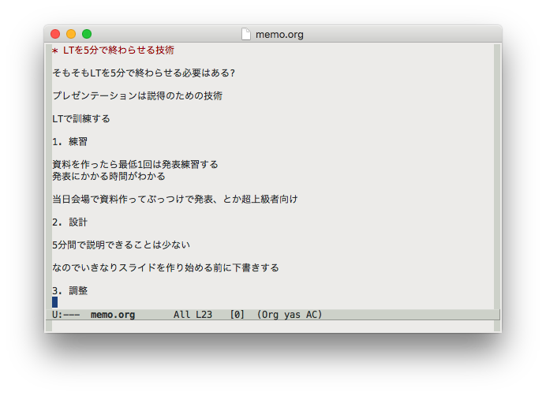
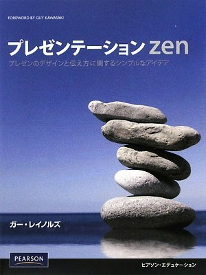
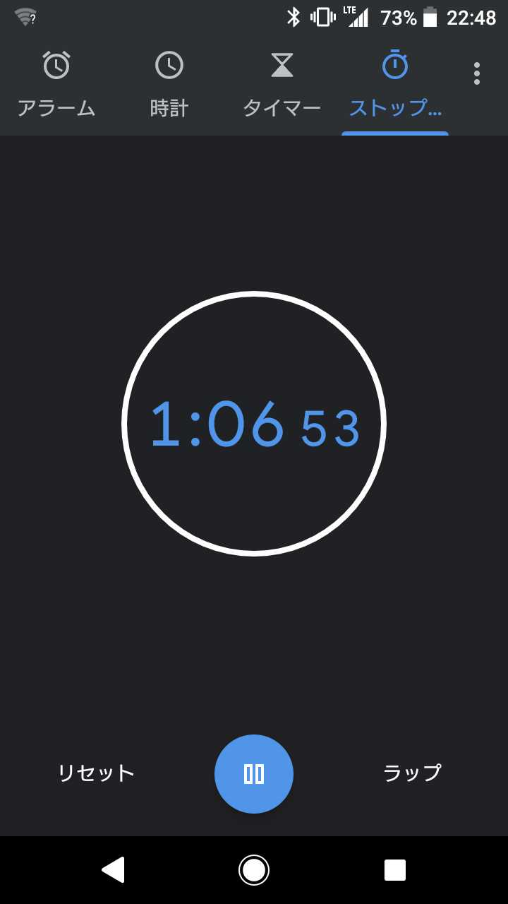

そもそもLTを5分で終わらせる必要はある?

---

### わからない

---

個人的には

---

プレゼンテーションは伝達のための技術で、

LTを5分に収めるのはその良い練習だと思う。

---

私がやっていること

---

1. 練習
2. 設計
3. 調整

---

# 1. 練習

---

資料を作ったら**最低でも1回**は発表練習する

そうすれば発表にかかる時間がわかる

---

何回か練習すれば流暢に説明できるようになる

---

当日会場で資料作ってぶっつけで発表、

とか超上級者向け

---

# 2. 設計

---

5分間で説明できることは

思ったより少ない

---

5分間でわかりやすく説明できることは

思ったよりかなり少ない

---

なのでいきなりスライドを作り始める前に

### 下書きする

---

{style="box-shadow:none"}

---

話の流れ

---

そのLTで**最も伝えたいこと**は何か

---

ストーリーを設計しよう

---

---

すべてのスライドが意味を持つように

---

# 3. 調整

---

プレゼンテーションはインタラクティブ

聴衆に質問したり

デモしたり

反応が返ってきたり

---

たいてい練習通りには行かない

---

なので発表中に時計を見て調整しよう

---

{width="25%"}

---

# まとめ

---

1. 練習
2. 設計
3. 調整

---

俳句は五七五

---

LTは5分でなんか言う遊び

---

## Enjoy!
