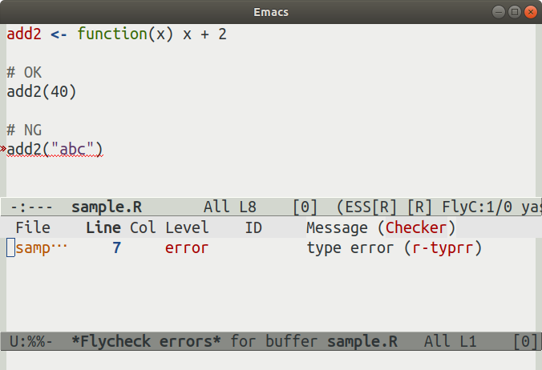

<div style="display: inline-block">
<blockquote class="twitter-tweet" data-lang="ja"><p lang="en" dir="ltr">My new favorite meme <a href="https://t.co/s2ksKAvmKB">pic.twitter.com/s2ksKAvmKB</a></p>&mdash; Gordon Shotwell (@gshotwell) <a href="https://twitter.com/gshotwell/status/1100773100617121793?ref_src=twsrc%5Etfw">2019年2月27日</a></blockquote>
</div>

<script async src="https://platform.twitter.com/widgets.js" charset="utf-8"></script>

---

## 片づけ

---

## ~~片づけ~~

---

## 型付け

---

Rの型検査を実装した話をします。

---

Rは動的型付け言語

---

型に関する間違いは**実行時**に見つかる

---

```r
year <- "2018"

# すごく時間がかかる処理
do_something(year)

year + 1
```

<div class="fragment">
実行すると、すごく時間が経ってから
</div>

<div class="fragment">
```r
 year + 1 でエラー:  二項演算子の引数が数値ではありません
```
</div>

---

かなしい

---

実行前に教えてほしい

---

ところで最近こんな本を読んだ

---

{width="40%"}

---

最後の章に型推論のアルゴリズムが書いてあった。

---

Rで実装してみた。

---

## typrr

<https://github.com/igjit/typrr>

---

インストール

```r
devtools::install_github("igjit/typrr")
```

---

## あそびかた

---

Rのコードを

```r
# foo.R
n <- 1
n + "abc"
```

---

静的型検査

```r
> typrr::type_check("foo.R")
$line
[1] 3

$column
[1] 1

$message
[1] "type error"
```

型エラーの箇所がわかる

---

わかりづらいので

Emacs([Flycheck](https://www.flycheck.org))の拡張を[実装](https://github.com/igjit/typrr/blob/master/inst/emacs/flycheck-typrr.el)

<div class="fragment text-small" style="padding: 0.2em">
(ちなみに、RStudio以外だと[ESS](https://ess.r-project.org/) (Emacs Speaks Statistics)が良いよ、って[Hadleyも言ってる。](http://r-pkgs.had.co.nz/intro.html))
</div>

---

コードを書いてる最中に型エラーがわかる


---

関数呼び出し時の型エラー



---

関数の戻り値に関する型エラー


---

*demo*

---

お詫び

---

今のところ

## 実用性は全く無い

---

対応している構文要素は少ない

<div style="padding: 0.2em">
- 基本型
    - integer, double, logical, character
- 代入演算子
- 関数定義
    - 引数が1つのもののみ
- 関数呼び出し
</div>

---

単に**作るのが楽しいから**作っている。

---

人は、読むことではなく、することによって学習するのである。

<p class="text-small">
[RStudioではじめるRプログラミング入門](https://www.oreilly.co.jp/books/9784873117157/)
</p>

---

## Enjoy!
