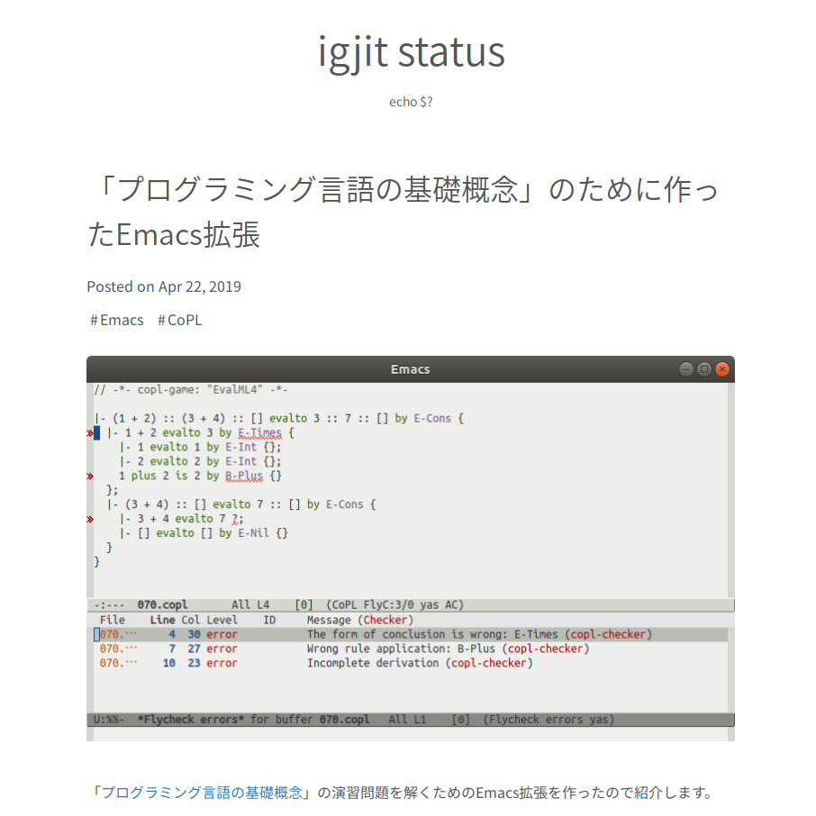
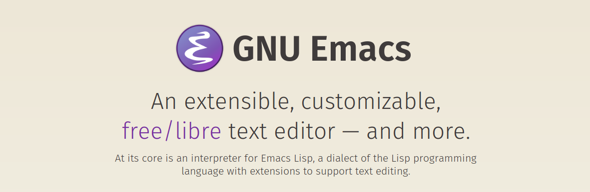

{width=256}

[\@igjit](https://twitter.com/igjit)

- Webアプリケーションエンジニア
- [Rで変なものを作るのが趣味](https://igjit.github.io/slides/)

---

major-mode作ったことある人？

---

最近、初めてmajor-modeを作りました。

---

<p class="text-small">
<https://igjit.github.io/posts/2019/04/emacs-lisp-for-copl/>
</p>



---

そのときに参考になったものや、得られた知見を共有します。

もっと良いやり方あったら教えてください。

---

## 発端

---

{width="40%"}

---

関数型言語MLの一種Objective Camlを題材としてプログラミング言語の意味論，型システム，プログラミング言語の基礎概念，これらの概念間の数学的な関連を学ぶ．**オンライン演習システム**を用いて，「証明」を解答とする演習問題の正誤をWeb上で自動判定することもできる．

*[内容詳細](http://www.saiensu.co.jp/?page=book_details&ISBN=ISBN978-4-7819-1285-1)*

---

オンライン演習システムで


---

回答があっているか確認


---

エディタの補助が欲しい

- シンタックスハイライト
- インデント

---

編集して送信、を繰り返すの面倒

---

なんとかしよう

---

<p class="text-small">
<http://www.wilfred.me.uk/blog/2015/03/19/adding-a-new-language-to-emacs/>
</p>


---

を参考にしながら

---

- major-mode
- Flycheck拡張

を実装

---

## major-mode

---

[igjit/copl-mode](https://github.com/igjit/copl-mode)


---

- シンタックスハイライト
- インデント (雑)

---

`define-derived-mode` で派生モードを作る

<div class="fragment" style="padding: 0.2em">
[syohex/emacs-hcl-mode](https://github.com/syohex/emacs-hcl-mode) などを参考にしながら実装
</div>

---

こういう複数行コメントの対応

```ml
(* 複数行の
 * コメント *)
```

<div class="fragment">
<http://emacs.rubikitch.com/syntax-table-beginner/> が参考になる
</div>

---

## インデント

---

自前でインデント量を計算

or

[SMIE](https://www.gnu.org/software/emacs/manual/html_node/elisp/SMIE.html)を使うべき

---

(時間が無かったので[実装を諦めました](https://github.com/igjit/copl-mode/blob/87d4633afd2232f1b2652d6dd03fb6dc7d4f28a1/copl-mode.el#L306))

---

## Flycheck拡張

---

[igjit/flycheck-copl](https://github.com/igjit/flycheck-copl)


---

書いてる最中にエラーがわかる


---

仕組み

---

著者の五十嵐先生が公開している[copl-tools](https://github.com/aigarashi/copl-tools)をdockerで動かす

[igjit/docker-copl-tools](https://github.com/igjit/docker-copl-tools)

---

構文チェッカーの標準出力を

```sh
$ echo 'Z plus Z is Z ?' | docker run --rm -i copl-tools checker -game Nat

line 1, character 14 -- line 1, character 15
Incomplete derivation
```

Flycheckでparseするだけ

---

詳細は[Developer’s Guide](https://www.flycheck.org/en/latest/developer/developing.html)に

---

簡単なのでみんなもFlycheck拡張作ろう:

[できる Flycheck拡張 (shell scriptでチェッカーを実装する)](https://igjit.github.io/posts/2019/04/flycheck-in-shell/)

---

最近作ったやつ:

[Rの型チェッカー](https://igjit.github.io/slides/2019/04/typrr/#/20)

---

## 結果

---

Emacsで快適に演習問題を解けるようになった！

---


---

問題たくさん解いた。(57 / 431 位)


---

extensible, customizable



<p class="text-small">
<https://www.gnu.org/software/emacs/>
</p>

---

### Happy hacking!
