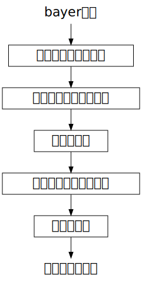

{width=256}

[\@igjit](https://twitter.com/igjit)

- Webアプリケーションエンジニア
- [Rで変なものを作る](https://igjit.github.io/slides/)のが趣味
- [インスタ](https://www.instagram.com/igjit1/)始めました

---

最近こんな本を買いました

---

{width="30%"}

<p class="text-small" style="margin-top:0">
<https://moiz.booth.pm/items/1307327>
</p>

---

**Python**とColabでできる - ゼロから作るRAW現像

---

ところでRAW現像とは

---

デジカメは一般的にJPEG形式で画像を保存する

<div class="fragment">
それに対してカメラの光センサーの情報をそのまま保存したものがRAWデータ
</div>

<div class="fragment">
RAWデータから画像を生成するのが**RAW現像**
</div>

---

JPEGよりも情報量が多いので柔軟に編集できる

{width=70%}

---

カメラ画像処理について

---

画像処理パイプライン



---

えっ？

パイプライン？

---


---

## Rでやれば良いのでは

---

やってみた

---


<p class="text-small" style="margin-top:0">
<https://igjit.github.io/camera-raw-processing-r/>
</p>

---

インストール

---

- R
    - [imager](https://github.com/dahtah/imager) (画像処理ライブラリ)
    - [reticulate](https://rstudio.github.io/reticulate/) (RからPython呼ぶやつ)
    - [tidyverse](https://www.tidyverse.org/) (宇宙)
- Python
    - [rawpy](https://pypi.org/project/rawpy/) (RAW画像読み込むやつ)

<p class="text-small text-muted" style="padding: 0.5em">
Rでできる、と言いつつRAW画像の読み込みにPythonを使う
</p>

---

面倒くさい

---

Docker imageを作った

---

{width="80%"}

<p class="text-small" style="margin-top:0">
<https://hub.docker.com/r/igjit/r-raw-processing>
</p>

---

docker pullして実行すると

```sh
docker pull igjit/r-raw-processing
docker run --rm -p 8787:8787 -e PASSWORD=xxxx igjit/r-raw-processing
```

---

RStudioでRAW現像できる


---

## あそびかた

---

[原著者のGitHubリポジトリ](https://github.com/moizumi99/camera_raw_processing)からRAWデータをダウンロード

```sh
wget https://github.com/moizumi99/camera_raw_processing/raw/master/chart.jpg
```

---

画像データをRの行列に読み込みこんで

```r
library(reticulate)
library(imager)

rawpy <- import("rawpy")

raw_file <- "chart.jpg"
raw <- rawpy$imread(raw_file)
raw_array <- raw$raw_image
```

---

パイプで処理をつなぐ


---

無加工で表示

```r
raw_array %>% t %>% as.cimg %>% plot
```
{width="50%"}

---

デモザイクして表示

```r
raw_array %>%
  simple_demosaic %>%
  ta %>% as.cimg %>% plot
```

{width="50%"}

---

ホワイトバランス補正、デモザイクして表示

```r
raw_array %>%
  white_balance(raw$camera_whitebalance, raw$raw_colors) %>%
  simple_demosaic %>%
  normalize %>%
  ta %>% as.cimg %>% plot
```

{width="50%"}

---

## 楽しい！

---

*demo*

---

今後の更新にご期待下さい

{width="80%"}

<p class="text-small" style="margin-top:0">
<https://igjit.github.io/camera-raw-processing-r/>
</p>

---

ここをクリック↓

{width="60%"}

<p class="text-small" style="margin-top:0">
<https://github.com/igjit/camera-raw-processing-r>
</p>

---

### まとめ

---

Rは統計専用の言語ではない。

---

RでRAW現像できる。

---

RでRAW現像すると楽しい。

- ベクトル演算
- `%>%`
- NSE

---

あなたはRで何を作る？

---

### Enjoy!
