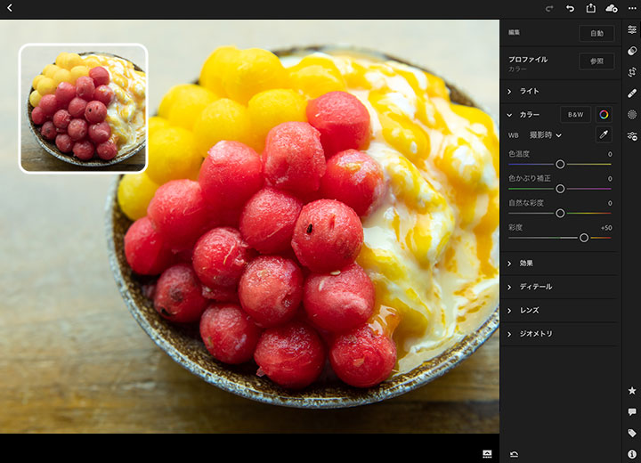

<script async src="https://platform.twitter.com/widgets.js" charset="utf-8"></script>

{width=256}

[\@igjit](https://twitter.com/igjit)

- Webアプリケーションエンジニア
- [Rで変なものを作る](https://igjit.github.io/slides/)のが趣味
- [山とタピオカと私](https://twitter.com/search?q=%40igjit%20%E3%82%BF%E3%83%94%E3%82%AA%E3%82%AB&f=live)

---

Tokyo.R #79で[紹介](https://igjit.github.io/slides/2019/06/raw-processing-r/#/)した本

---

{width="30%"}

<p class="text-small" style="margin-top:0">
<https://moiz.booth.pm/items/1307327>
</p>

---

twitterで見かけた感想

---

<div style="display: inline-block">
<blockquote class="twitter-tweet"><p lang="ja" dir="ltr">とりあえず pip install rawpy してみたけれど Lightroom のほうが楽だ（当たり前）</p>&mdash; Haruhiko Okumura (@h_okumura) <a href="https://twitter.com/h_okumura/status/1144955614868590592?ref_src=twsrc%5Etfw">June 29, 2019</a></blockquote>
</div>

---

ですよね。

---

[Adobe Lightroom](https://www.adobe.com/jp/products/photoshop-lightroom.html)



---

インタラクティブに写真編集


---

えっ？

インタラクティブなUI？

---

## それShinyで作れるのでは

---

作ってみた

---


---

Shinyで作ったLightroomっぽいアプリなので

<div class="fragment">
## shinyroom
</div>

---

コードはこちら

### [igjit/shinyroom](https://github.com/igjit/shinyroom)

---

Herokuで動かしてるデモ

[shinyroom.herokuapp.com](https://shinyroom.herokuapp.com/)

<p class="text-small text-muted" style="padding: 0.5em">
(めっちゃ遅い)
</p>

---

手元で動かす場合は

```sh
git clone git@github.com:igjit/shinyroom.git
cd shinyroom
docker build -t shinyroom .
docker run -it --rm -p 8000:8000 -e PORT=8000 shinyroom
```

して [localhost:8000](http://localhost:8000/) にアクセス

---

*demo*

---

正直

<div class="fragment">
### 今のところ実用性はない
</div>

---

今後の開発にご期待ください

---

## shinyroomを支える技術

---

## [imager](https://github.com/dahtah/imager)

画像処理ライブラリ

---

## [golem](https://github.com/ThinkR-open/golem)

頑強なShinyアプリを作るためのフレームワーク

Rのパッケージ開発の経験があるならおすすめ

[Building Big Shiny Apps](https://thinkr-open.github.io/building-shiny-apps-workflow/)を読むと良い

---

## [shinythemes](https://github.com/rstudio/shinythemes)

Shinyアプリの見た目を簡単に変えられる

---

これが


---

よりLightroomっぽく


---

### テストを書く

- [shinytest](https://github.com/rstudio/shinytest)
- [testthat](https://github.com/r-lib/testthat)

---

### 細かすぎて伝わらないShinyの挙動

---

サーバーが処理中であることを示すために


---

outputの色が薄くなる


---

問題は

---

画像処理の結果を待っているときに


---

こうなるのですごくうざい


---

なんとかするためにパッケージ作った

---


### [igjit/shinyloadermessage](https://github.com/igjit/shinyloadermessage)

---

処理中に


---

メッセージをかぶせる


---

使い方は簡単 ([shinycssloaders](https://github.com/andrewsali/shinycssloaders)と同様)

```r
library(shinyloadermessage)

# ...

withLoaderMessage(plotOutput("distPlot"))
```

---

### まとめ

---

作ってみた感想


---

## 楽しい!

---

Rだけで簡単にインタラクティブなwebアプリケーションを作れる

---

便利なパッケージたくさん

---

動くものを作るの楽しい

---

どんどん作ろう。

<div class="fragment">
作ったら共有しよう。
</div>

---

次はあなたの番！

---

### Enjoy!
