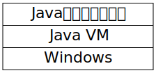
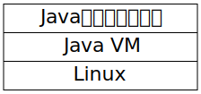
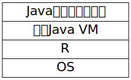

<script async src="https://platform.twitter.com/widgets.js" charset="utf-8"></script> 
 
{width=256}

<a href="https://twitter.com/igjit" class="name">@igjit</a>

- Webアプリケーションエンジニア
- [Rで変なものを作る](https://igjit.github.io/slides/)のが趣味
- [山とタピオカと私](https://twitter.com/search?q=%40igjit%20%E3%82%BF%E3%83%94%E3%82%AA%E3%82%AB&f=live)

---

Java使ったことある人？

---

Java VMとは

---

Java virtual machine

Java仮想マシン

---

Javaのソースコードは<br>Javaクラスファイルにコンパイルされる


---

これが

```java
public class Hello {
  public static void main (String[] args) {
    System.out.println("Hello, world.");
  }
}
```

---

こうなる

<div style="font-size: 0.7em">
```
00000000: cafe babe 0000 0037 001d 0a00 0600 0f09  .......7........
00000010: 0010 0011 0800 120a 0013 0014 0700 1507  ................
00000020: 0016 0100 063c 696e 6974 3e01 0003 2829  .....<init>...()
00000030: 5601 0004 436f 6465 0100 0f4c 696e 654e  V...Code...LineN
00000040: 756d 6265 7254 6162 6c65 0100 046d 6169  umberTable...mai
00000050: 6e01 0016 285b 4c6a 6176 612f 6c61 6e67  n...([Ljava/lang
00000060: 2f53 7472 696e 673b 2956 0100 0a53 6f75  /String;)V...Sou
00000070: 7263 6546 696c 6501 000a 4865 6c6c 6f2e  rceFile...Hello.
00000080: 6a61 7661 0c00 0700 0807 0017 0c00 1800  java............
00000090: 1901 000d 4865 6c6c 6f2c 2077 6f72 6c64  ....Hello, world
000000a0: 2e07 001a 0c00 1b00 1c01 0005 4865 6c6c  ............Hell
000000b0: 6f01 0010 6a61 7661 2f6c 616e 672f 4f62  o...java/lang/Ob
000000c0: 6a65 6374 0100 106a 6176 612f 6c61 6e67  ject...java/lang
000000d0: 2f53 7973 7465 6d01 0003 6f75 7401 0015  /System...out...
000000e0: 4c6a 6176 612f 696f 2f50 7269 6e74 5374  Ljava/io/PrintSt
000000f0: 7265 616d 3b01 0013 6a61 7661 2f69 6f2f  ream;...java/io/
00000100: 5072 696e 7453 7472 6561 6d01 0007 7072  PrintStream...pr
00000110: 696e 746c 6e01 0015 284c 6a61 7661 2f6c  intln...(Ljava/l
00000120: 616e 672f 5374 7269 6e67 3b29 5600 2100  ang/String;)V.!.
00000130: 0500 0600 0000 0000 0200 0100 0700 0800  ................
00000140: 0100 0900 0000 1d00 0100 0100 0000 052a  ...............*
00000150: b700 01b1 0000 0001 000a 0000 0006 0001  ................
00000160: 0000 0001 0009 000b 000c 0001 0009 0000  ................
00000170: 0025 0002 0001 0000 0009 b200 0212 03b6  .%..............
00000180: 0004 b100 0000 0100 0a00 0000 0a00 0200  ................
00000190: 0000 0300 0800 0400 0100 0d00 0000 0200  ................
000001a0: 0e                                       .
```
</div>

---

JavaクラスファイルはJava VM上で実行される


---

Java VMがあればJavaはどこでも動く



---

Java VMがあればJavaはどこでも動く


---

Java VMがあればJavaはどこでも動く



---

ある日見かけたツイート

---

<div style="display: inline-block">
<blockquote class="twitter-tweet"><p lang="ja" dir="ltr">本日の「PHP で JVM を実装して Hello World を出力するまで」の登壇資料です。PHP だけには限らず、 JS や Go など、他の言語でも JVM は実装可能なので、ぜひ試してみてくださいね！🙆 <a href="https://twitter.com/hashtag/builderscon?src=hash&amp;ref_src=twsrc%5Etfw">#builderscon</a> <a href="https://t.co/sUgQNIAzi4">https://t.co/sUgQNIAzi4</a></p>&mdash; めもりー🐱🐹 (@m3m0r7) <a href="https://twitter.com/m3m0r7/status/1167629306664603648?ref_src=twsrc%5Etfw">August 31, 2019</a></blockquote>
</div>

---

## 「PHPでJVMを実装して<br>Hello Worldを出力」

---

PHPは動的型付けの汎用スクリプト言語

---

Rも動的型付けの汎用スクリプト言語

---

## じゃあRでもできるんじゃね？

---

これを


---

こうする



---

やってみた。

---

## jvmrr

<https://github.com/igjit/jvmrr>

---

インストール

```r
# install.packages("remotes")
remotes::install_github("igjit/jvmrr")
```

---

## あそびかた

---

Javaのコードを

```java
public class Hello {
  public static void main (String[] args) {
    System.out.println("Hello, world.");
  }
}
```

---

コンパイルしたら

```sh
$ javac Hello.java
```

---

Rで読み込んで

```r
> library(jvmrr)
> java_class <- read_class("Hello.class")
```

---

実行できる

```r
> java_class %>% execute
Hello, world.
```

---

Fizz Buzzも

```java
class FizzBuzz {
  public static void main(String[] args) {
    for (int i = 1; i <= 20; i++) {
      if (i % 15 == 0) {
        System.out.println("FizzBuzz");
      } else if (i % 3 == 0) {
        System.out.println("Fizz");
      } else if (i % 5 == 0) {
        System.out.println("Buzz");
      } else {
        System.out.println(i);
      }
    }
  }
}

```

---

コンパイルしたら

```sh
$ javac FizzBuzz.java
```

---

R上で動く

```r
> read_class("FizzBuzz.class") %>% execute
1
2
Fizz
4
Buzz
Fizz
7
8
Fizz
Buzz
11
Fizz
13
14
FizzBuzz
16
17
Fizz
19
Buzz
```

---

<div style="color:#646464; font: normal 64px Helvetica,Arial,sans-serif">
あなたとjvmrr,
<div class="fragment">
<p style="line-height: 1em; margin: 0">
今すぐダウンロー<br>
ド
</p>
<a href="https://github.com/igjit/jvmrr" style="font-weight: bold; font-size: 24px; padding: 10px 50px; color: white; background-color: #f44; border-radius: 10px;">
無料jvmrrのダウンロード
</a>
</div>

---

使ったパッケージ

---


---

似たような関数のリストを作りたいとき

<div style="font-size: 0.7em">
```r
list(
  iadd = function(op, cp, env) {
    value2 <- pop(env$stack)
    value1 <- pop(env$stack)
    result <- value1 + value2
    push(env$stack, result)
  },
  isub = function(op, cp, env) {
    value2 <- pop(env$stack)
    value1 <- pop(env$stack)
    result <- value1 - value2
    push(env$stack, result)
  },
  ...
)
```
</div>

---

`purrr::map`で一気に生成できる

```r
list(iadd = `+`,
     isub = `-`,
     imul = `*`,
     idiv = `%/%`) %>%
  map(~ function(op, cp, env) {
    value2 <- pop(env$stack)
    value1 <- pop(env$stack)
    result <- .(value1, value2)
    push(env$stack, result)
  })
```

---


---

Javaバイトコードを書くためのDSLを[実装](https://github.com/igjit/jvmrr/commit/7e168f92e2ce764ca0efd8374b34196c3da1654f)

---

これを

```r
c(opcodes["bipush"], 40,
  opcodes["istore_1"],
  opcodes["iinc"], 1, 2)
```

<div class="fragment">
NSEで簡潔に書けるように

```r
with_op(bipush, 40,
        istore_1,
        iinc, 1, 2)
```
</div>

---

## [dequer](https://github.com/wrathematics/dequer)

データ構造 (queue, stack, double ended queue)

<div class="fragment">
Java VMはスタックマシンなので素直にstackを使う
</div>

---


---

テストを書くと結果的により速く実装できる

---

### まとめ

---

いつも言ってるけど

---

Rは統計専用の言語ではない。

---

RでJava VMを実装できる。

---

Rで何かを作ろうとしないときに

<div class="fragment">
それを制限しているのは多分言語ではなく
</div>

<div class="fragment">
あなたの心なのだ。
</div>

---

Rで何を書いても良いよ。

---

Rは楽しい言語

<div class="fragment">
- 関数プログラミング
- NSE
- メタプログラミング
- 便利なパッケージ
</div>

---

## Enjoy!
