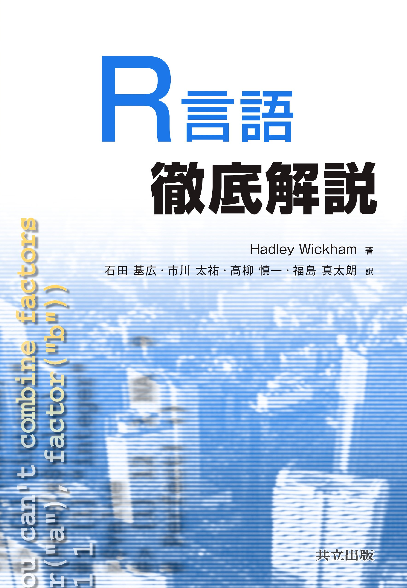
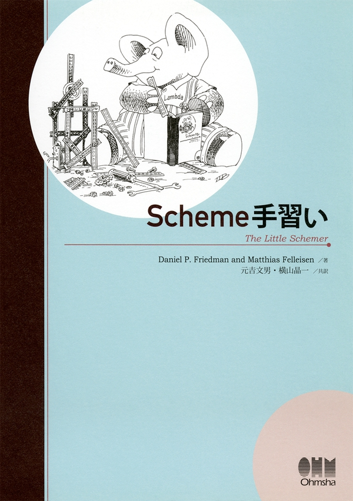
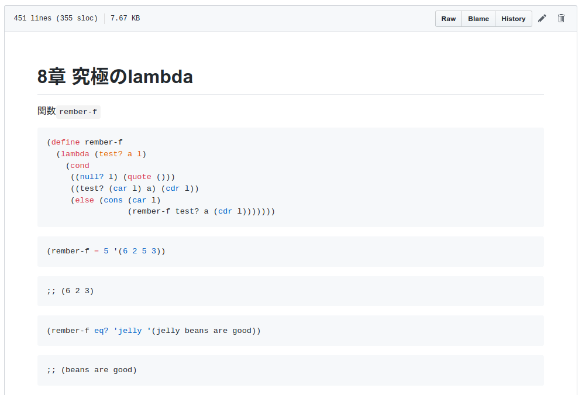

{width=256}

<a href="https://twitter.com/igjit" class="name">@igjit</a>

- Webアプリケーションエンジニア
- [Rで変なものを作る](https://igjit.github.io/slides/)のが趣味

---

私が今まで読んだ中で最高のRの本

---

{width="40%"}

---

この本の中で[Hadleyが勧めている](https://adv-r.hadley.nz/introduction.html#recommended-reading)本

---


---

## SICP

[計算機プログラムの構造と解釈](https://sicp.iijlab.net/fulltext/)

---

プログラミング言語LISPの方言**Scheme**が用いられ、抽象化、再帰、インタプリタ、メタ言語的抽象といった計算機科学の概念の真髄が説明されている。

<p class="text-small">
[計算機プログラムの構造と解釈 - Wikipedia](https://ja.wikipedia.org/wiki/%E8%A8%88%E7%AE%97%E6%A9%9F%E3%83%97%E3%83%AD%E3%82%B0%E3%83%A9%E3%83%A0%E3%81%AE%E6%A7%8B%E9%80%A0%E3%81%A8%E8%A7%A3%E9%87%88)
</p>

---

RユーザーはSchemeを学ぶ必要があるのでは

---

でもいきなりSICPはハードル高い

---

もっと親しみやすい本

---

{width="40%"}

---

「この本を読んで人生が変わった」という感想を何回か聞いたことがあります。なぜなら、物事を再帰で考えられるようになるからです。

<p class="text-small">
[The Little Schemer - あどけない話](https://kazu-yamamoto.hatenablog.jp/entry/20080402/1207127522)
</p>

---

Schemeを始めて人生を変えよう。

---

再帰がわかると

<div class="fragment">
再帰的な構造を自然に扱えるようになる。
</div>

---

Rで変なものを作るために再帰が必要

- [コンパイラ](https://igjit.github.io/slides/2018/12/nrc/#/)
- [インタプリタ](https://igjit.github.io/slides/2018/03/lisprr/#/)
- [型検査](https://igjit.github.io/slides/2019/04/typrr/#/)
- [Java VM](https://igjit.github.io/slides/2019/12/jvmrr/#/)

---

## 本題

---


---

R MarkdownでScheme手習いを写経したい

---

R Markdownは[いろんな言語に対応](https://bookdown.org/yihui/rmarkdown/language-engines.html)している

<div style="font-size: 0.8em">
```r
> names(knitr::knit_engines$get())
 [1] "awk"       "bash"      "coffee"    "gawk"     
 [5] "groovy"    "haskell"   "lein"      "mysql"    
 [9] "node"      "octave"    "perl"      "psql"     
[13] "Rscript"   "ruby"      "sas"       "scala"    
[17] "sed"       "sh"        "stata"     "zsh"      
[21] "highlight" "Rcpp"      "tikz"      "dot"      
[25] "c"         "fortran"   "fortran95" "asy"      
[29] "cat"       "asis"      "stan"      "block"    
[33] "block2"    "js"        "css"       "sql"      
[37] "go"        "python"    "julia"     "sass"     
[41] "scss"     
```
</div>

---

でもSchemeには対応してない

```r
> knitr::knit_engines$get("scm")
NULL
```

---

なので実装した

---

## knitscm

<https://github.com/igjit/knitscm>

---

インストール

```r
# install.packages("remotes")
remotes::install_github("igjit/knitscm")
```

---

Scheme処理系のインストール

<p class="text-small">
(現在knitscmは[Gauche](http://practical-scheme.net/gauche/index-j.html)をサポートしている)
</p>

<p style="margin-bottom:0">
Mac
</p>

```sh
brew install gauche
```

<p style="margin-bottom:0">
Ubuntu
</p>

```sh
sudo apt install gauche
```

---

## あそびかた

---

こんなR Markdownを書くと

````md
```{r setup, include=FALSE}
library(knitscm)
handle <- run_gauche()
knitr::opts_chunk$set(handle = handle)
```

```{scm}
(+ 40 2)
```
````

---

実行結果がrenderされる

``` scm
(+ 40 2)
```

    ;; 42

---

ところで

---

r, python, julia以外のknit engineでは \
code chunkはそれぞれ別のセッションで実行される。

---

つまり

````md
```{bash}
name=foo    # この変数が
```

```{bash}
echo $name  # ここで参照できない
```
````

---

knitscmではSchemeのプロセスをchunk間で共有することで

```r
handle <- run_gauche()
knitr::opts_chunk$set(handle = handle)
```

---

chunkをまたいで実行できる

````md
```{scm}
(define (add2 x)
  (+ x 2))
```

```{scm}
(add2 40)
```
````

---

実装の結果

---

Scheme手習いを写経してGFMで[共有](https://github.com/igjit/sandbox/tree/master/little-schemer)できるように



---

## まとめ


---

Schemeのknit engineを実装した。

---


みんなもR MarkdownでSchemeを書こう。

---

そして一緒に変なもの作ろう。

---

## Enjoy!
