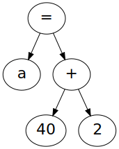
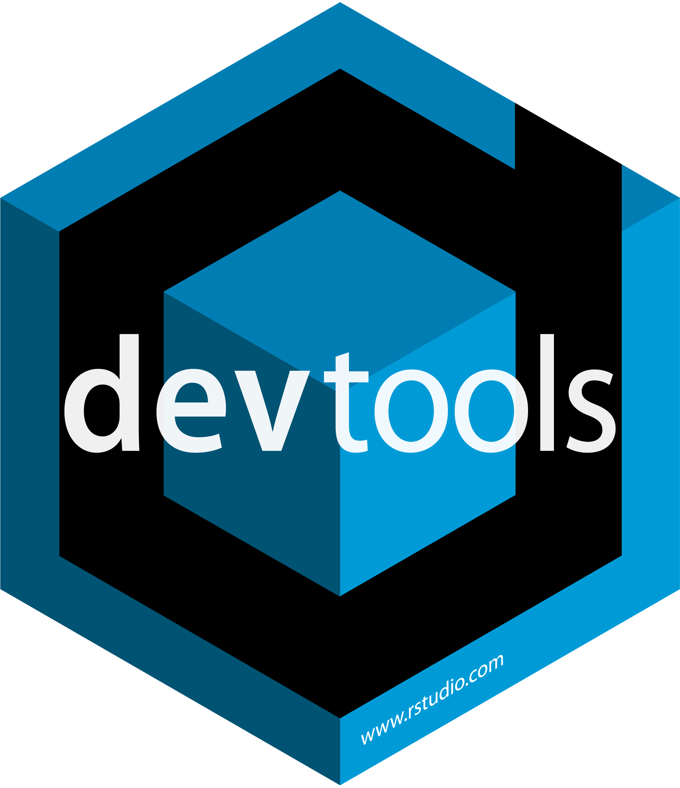

<style type="text/css" rel="stylesheet">
.reveal .bordered-table table td { border: 1px solid; }
.reveal .bordered-table table tbody tr:last-child td { border: 1px solid; }
.reveal .hidden-del del { visibility: hidden; }
</style>

{width=256}

<a href="https://twitter.com/igjit" class="name">@igjit</a>

- Webアプリケーションエンジニア
- [Rで変なものを作る](https://igjit.github.io/slides/) 人

---

質問

---

プログラムが動く仕組みを説明できますか？

---

あなたの書いたコードは単なる文字に過ぎない

```r
a = 40 + 2
```

---

どういう仕組みで解釈され、計算されるのか

```r
a = 40 + 2
```

---

{width="40%"}

<p class="text-small" style="margin-top:0">
<https://www.oreilly.co.jp/books/9784873117126/>
</p>

---

「コンピュータを理解するための最善の方法はゼロからコンピュータを作ることです。」

---

コンピュータシステムの理論と実装

通称 [nand2tetris](https://www.nand2tetris.org/) (Nand to Tetris)

---

コンピュータの構成要素

- ハードウェア
- ソフトウェア
- コンパイラ
- OS

をひとつずつ実装していく

---

[NANDゲート](https://ja.wikipedia.org/wiki/NAND%E3%82%B2%E3%83%BC%E3%83%88)から始まって

{width=25%}

---

最終的にゲームが動くようになるよ

{width=65%}

<div class="fragment">
<p class="text-muted">
(Nand to Tetrisと言いつつテトリスではない)
</p>
</div>

---

本に登場する階層のうち

<div class="bordered-table" style="font-size: 0.7em; margin-top:2em">

-----------------------
 アプリケーション
 OS
 コンパイラ
 バーチャルマシン
 アセンブラ
 機械語
 ハードウェア
-----------------------

</div>

---

これらをRで実装

<div class="bordered-table hidden-del" style="font-size: 0.7em; margin-top:2em">

-----------------------
 ~~アプリケーション~~
 ~~OS~~
 コンパイラ
 バーチャルマシン
 アセンブラ
 ~~機械語~~
 ~~ハードウェア~~
-----------------------

</div>

---

順に紹介します。

---

## 1. アセンブラ

---

<div class="bordered-table" style="font-size: 0.7em; margin-top:2em">

-----------------------
 アプリケーション
 OS
 コンパイラ
 バーチャルマシン
 **アセンブラ**
 機械語
 ハードウェア
-----------------------

</div>

---

### アセンブラ

アセンブリ言語をバイナリに変換する

---

アセンブリ言語を

```
@2
D=A
@3
D=D+A
@0
M=D
```

---

バイナリに変換

```
0000000000000010
1110110000010000
0000000000000011
1110000010010000
0000000000000000
1110001100001000
```

---

ハードウェアに対する命令なので低水準

```
@2
D=A
@3
D=D+A
@0
M=D
```

<div class="fragment">
ちなみにこれは `2 + 3` を計算するコード
</div>

---

Rによるアセンブラの実装

[assembler](https://github.com/igjit/nand2tetris/tree/master/r/assembler)

---

## 2. バーチャルマシン

---

Virtual Machine (VM)

抽象化されたコンピュータ

---

この本で作るのはVM変換器 (VM translator)

---

VMコードをアセンブリコードに変換する

<div class="bordered-table" style="font-size: 0.7em; margin-top:2em">

-----------------------
 アプリケーション
 OS
 コンパイラ
 **バーチャルマシン**
 アセンブラ
 機械語
 ハードウェア
-----------------------

</div>

---

`2 + 3` を計算するVMコード

```
push constant 2
push constant 3
add
```

<div class="fragment">
アセンブリより読みやすい
</div>

---

### [スタックマシン](https://ja.wikipedia.org/wiki/%E3%82%B9%E3%82%BF%E3%83%83%E3%82%AF%E3%83%9E%E3%82%B7%E3%83%B3) (stack machine)

という計算モデル

---

RによるVM変換器の実装

[vmtranslator](https://github.com/igjit/nand2tetris/tree/master/r/vmtranslator)

---

## 3. コンパイラ

---

<div class="fragment">
高級言語をVMコードに変換する
</div>

<div class="bordered-table" style="font-size: 0.7em; margin-top:2em">

-----------------------
 アプリケーション
 OS
 **コンパイラ**
 バーチャルマシン
 アセンブラ
 機械語
 ハードウェア
-----------------------

</div>

---

Jack言語のコード

```java
class Main {
   function void main() {
      do Output.printString("Hello world!");
      do Output.println();
      return;
   }
}
```

<div class="fragment">
普通に読める
</div>

---

コンパイルの流れ

- 字句解析
- 構文解析
- コード生成

---

### 字句解析

トークンに分割する

---

`a = 40 + 2` をトークンに分割

```r
> jackanalyzer::tokenize("a = 40 + 2")
[[1]]
$identifier
[1] "a"

attr(,"class")
[1] "identifier_token" "token"           

[[2]]
$symbol
[1] "="

attr(,"class")
[1] "symbol_token" "token"       

[[3]]
$int_val
[1] 40

attr(,"class")
[1] "int_const_token" "token"          

[[4]]
$symbol
[1] "+"

attr(,"class")
[1] "symbol_token" "token"       

[[5]]
$int_val
[1] 2

attr(,"class")
[1] "int_const_token" "token"          
```

---

### 構文解析

文法にそって解釈する


---

`a = 40 + 2` の構文木




---

### コード生成

ターゲット言語のコードを生成する

---

<p class="text-muted">
(時間がないので詳細は略)
<p/>

---

RによるJackコンパイラの実装

[jackanalyzer](https://github.com/igjit/nand2tetris/tree/master/r/jackanalyzer)

---

コンパイル結果のVMコードは、[公式サイト](https://www.nand2tetris.org/)で公開されているVMエミュレータで実行できる

{width=60%}

---

*demo*

---

実装にかかった行数

<div class="fragment" style="font-size: 0.8em; margin-top:2em">
|           | 行数|
|:----------|----:|
|アセンブラ |  206|
|VM変換器   |  323|
|コンパイラ |  788|
</div>

---

強力な抽象は実装が大変

<div style="font-size: 0.8em; margin-top:2em">
|           | 行数|
|:----------|----:|
|アセンブラ |  206|
|VM変換器   |  323|
|コンパイラ |  788|
</div>

---

## 実装のこつ

---

### テストを書こう

{width=25%}

---

楽をするためにテストを書く

<div class="fragment">
一度テストを書けばいつでもプロジェクト全体をテストできる
</div>

<div class="fragment">
常に自分の変更に自信が持てるようになる
</div>

---

### パッケージを作ろう

{width=25%}
{width=25%}

---


パッケージにすればコードを楽に再利用できる

<div class="fragment">
自分しか使わないとしてもパッケージにする価値はある
</div>

<div class="fragment">
[devtools](https://devtools.r-lib.org/)でコードのリロード、テスト実行が簡単
</div>

---

namespaceを分離できる

```r
assembler::parse()
vmtranslator::parse()
jackanalyzer::parse()
```

---

[Rパッケージ開発入門](https://www.oreilly.co.jp/books/9784873117591/)を読もう。

原著の第2版が[webで読めるよ](https://r-pkgs.org/index.html)。

---

## まとめ

---

アセンブラ、VM、コンパイラをRで実装した。

---

自分で作ることで

その仕組みを深く理解できる。

---

作る

<div class="fragment">
動かす
</div>

<div class="fragment">
理解する
</div>

---

プログラミングは楽しい！

---

## Enjoy!
