

{width=256}

<a href="https://twitter.com/igjit" class="name">@igjit</a>

- ソフトウェアエンジニア
- [Rで変なものを作る](https://igjit.github.io/slides/) 人

---

共著で本を書きました。

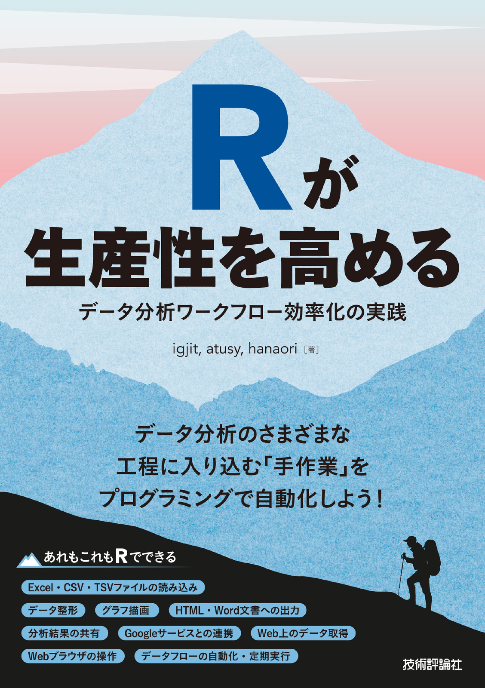{width="30%"}

<https://gihyo.jp/book/2022/978-4-297-12524-0>

---

本題

---

Kaggleコンペに初挑戦して

銅メダルを獲りました！
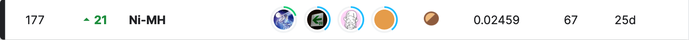

---

### 概要

---

[H&M Personalized Fashion Recommendations](https://www.kaggle.com/competitions/h-and-m-personalized-fashion-recommendations/overview)

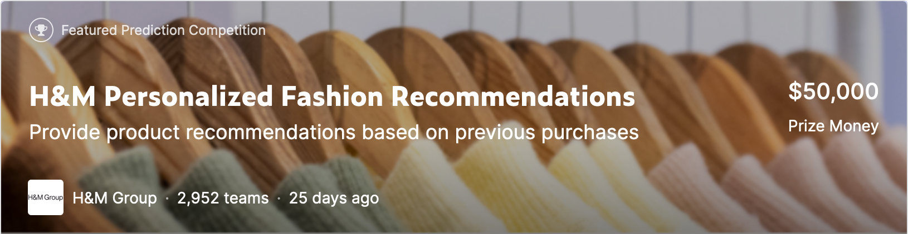

過去の購買履歴を元にファッションアイテムを推薦する

---

### チーム

---

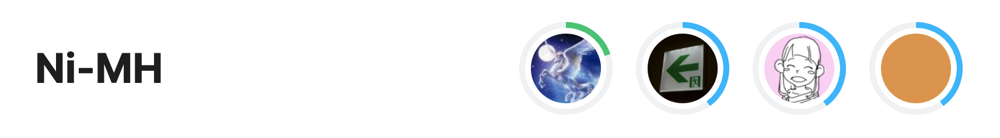{width="70%"}

- 会社の同僚
- データエンジニア2人、データアナリスト2人

---

やったこと

---

### まずは評価指標を確認

---

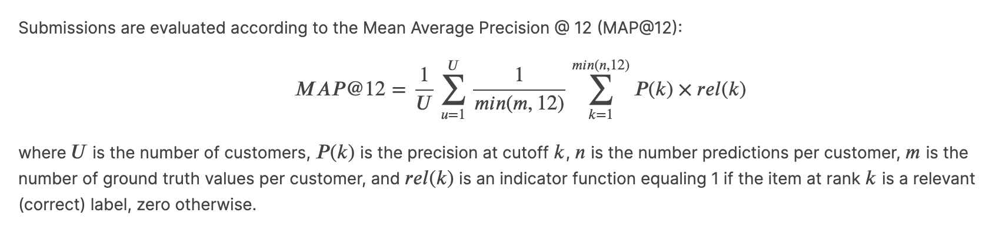{.img-shadow width="100%"}

<https://www.kaggle.com/competitions/h-and-m-personalized-fashion-recommendations/overview/evaluation>

---

なるほどわからん

---

[Kaggleで勝つデータ分析の技術](https://gihyo.jp/book/2019/978-4-297-10843-4)
を読む

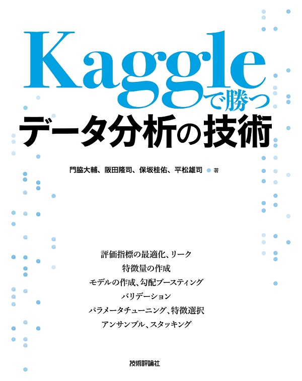{.img-shadow width="30%"}

----

2.3.6 レコメンデーションにおける評価指標

で MAP@K がくわしく説明されている。

---

### とりあえずfirst submit

---

Kaggle NotebookでR, Pythonのコードを実行、共有できる。

[Rでコードを書いて](https://www.kaggle.com/code/igjit1/my-first-h-m-submission-with-r)submit

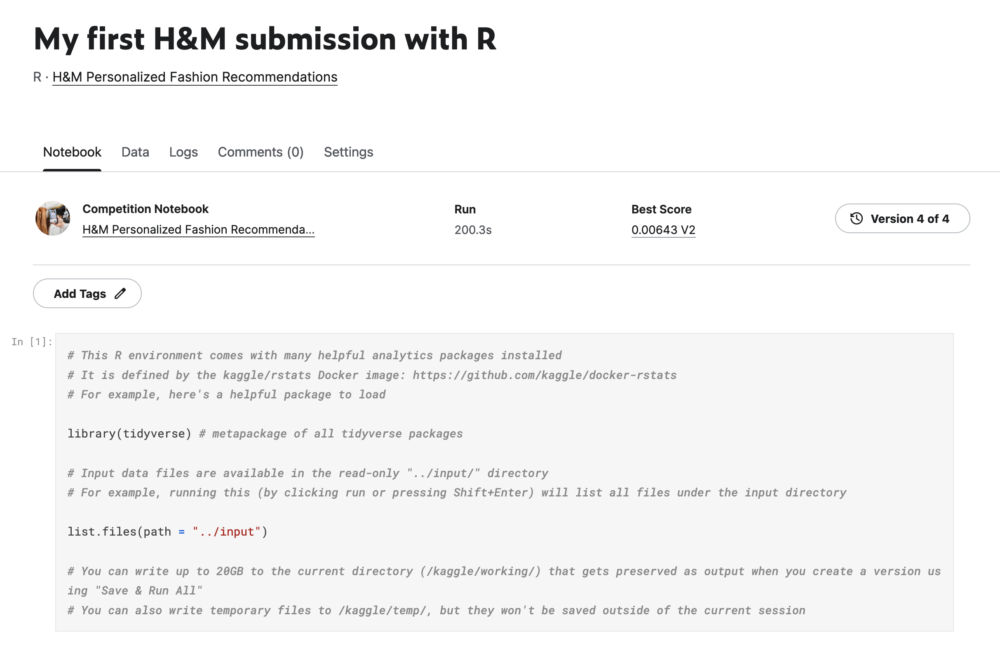{.img-shadow width="80%"}

---

### 他の人のNotebookを読む

---

有用なNotebookが多数公開されているので読んで参考にする

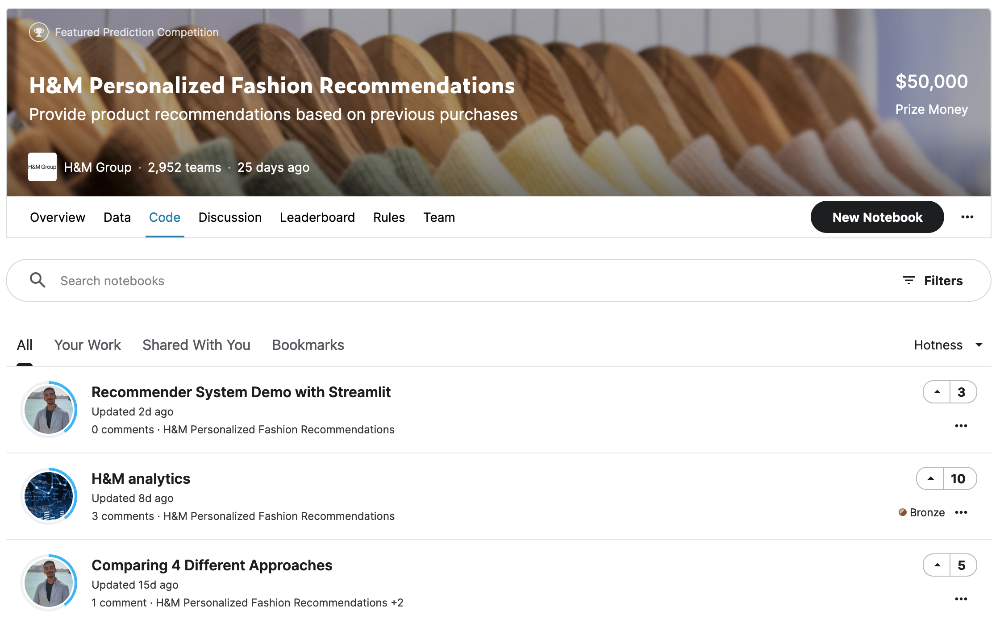{.img-shadow width="75%"}

----

私は

- [Recommend Items Purchased Together - [0.021]](https://www.kaggle.com/code/cdeotte/recommend-items-purchased-together-0-021)
- [H&M Trending Products Weekly](https://www.kaggle.com/code/byfone/h-m-trending-products-weekly)
- [H&M EDA & Rule Base by Customer Age](https://www.kaggle.com/code/hechtjp/h-m-eda-rule-base-by-customer-age)

を参考にして

---

ルールベースの推薦を[Rで実装](https://www.kaggle.com/code/igjit1/lb-0-0235-h-m-rule-base-solution-in-r)

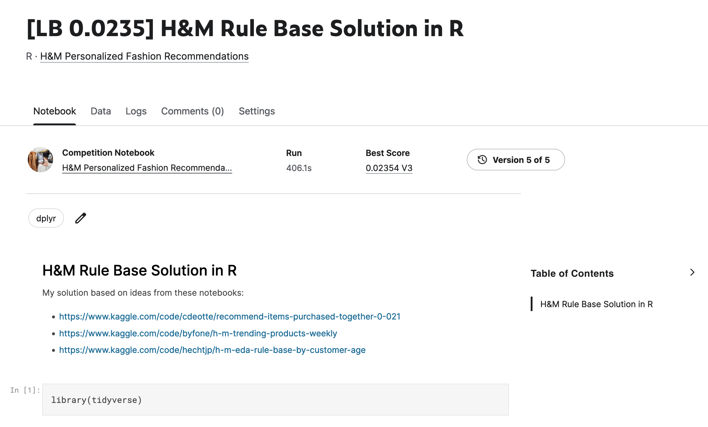{.img-shadow width="80%"}

---

個々のスコアはメダル圏に達しなかったけど

---

最終日にチームみんなの予測をアンサンブルさせた結果、

銅メダルを獲得できた！

---

後日

---

上位のチームの解法が多数公開されていて

- [実務でレコメンドをやっているのでKaggle H&Mコンペに参加しました](https://yng87.github.io/blog/2022/05/kaggle_hm/)
- [【Kaggle】H&Mコンペ参加記(133rd/2952🥈)](https://zenn.dev/zerebom/articles/9e6bad764d3f97)
- [DeNA・MoT AI技術共有会発表資料 H&Mコンペの振り返り](https://speakerdeck.com/kuto5046/denamot-aiji-shu-gong-you-hui-fa-biao-zi-liao-h-and-mkonpefalsezhen-rifan-ri)

---

- 1st stage: 質の高い複数のcandidate generation
- 2nd stage: GBDTでreranking

の2-stageレコメンドが一般的だった模様

---

Rでも[Tidymodels](https://www.tidymodels.org/)で[LightGBM](https://lightgbm.readthedocs.io/en/latest/R/index.html)を使えるし、  
Rで上位を目指せたかもしれない。

---

Q: RでKaggleを戦えるのか

---

A: コンペによってはいけるかも

---

ただ、現時点では、Pythonを読む必要がある

---

H&Mコンペで公開されたNotebokの数

|        |   n |
|:---|---:|
| Python | 405 |
| R      |  14 |

----

そのうち4件は私

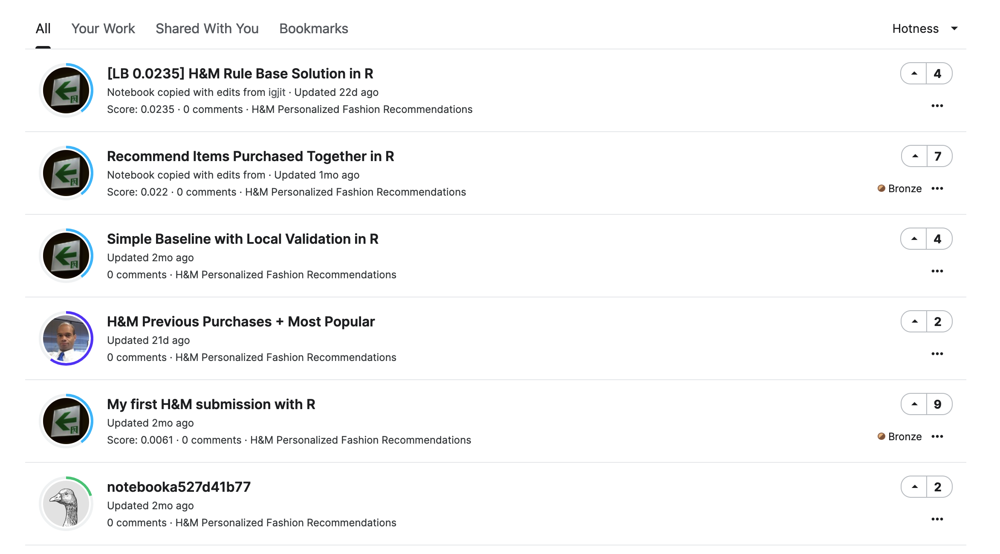{.img-shadow width="90%"}

---

みんなRでKaggleやろうな！

---

### Rで良かったところ

---

圧倒的に快適なデータ整形

{width=25%}
{width=25%}
{width=25%}

---

purrrで書いたリスト処理をfurrrでらくらく並列化

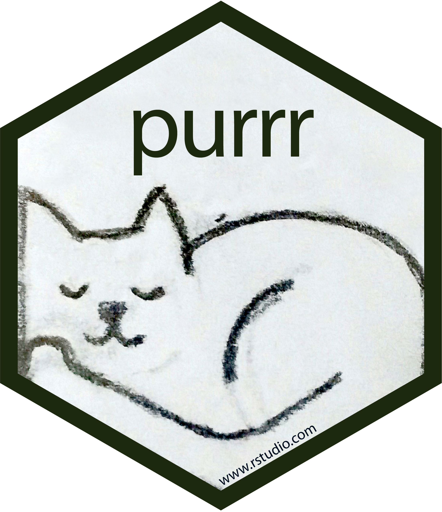{width=25%}
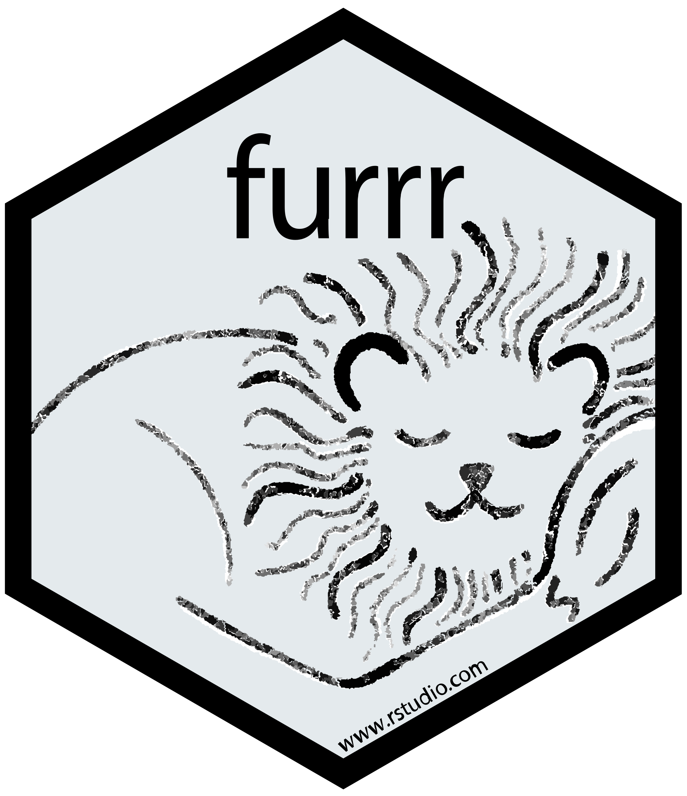{width=25%}

---

ほかにも便利なパッケージたくさん

{width=25%}
{width=25%}

---

みんなRでKaggleやろうな！

---

Kaggleは楽しい

- real worldの課題
- 世界中のエキスパートが同じ問題を解く
- チームメイトと友情・努力・勝利

---

## Enjoy!
