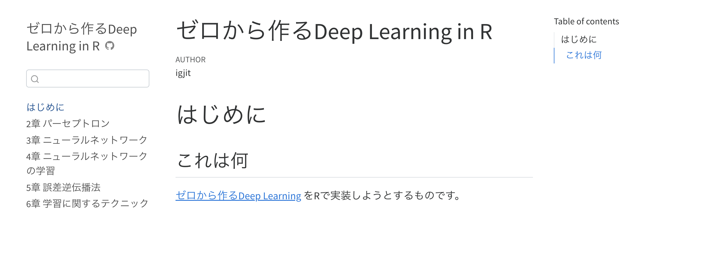
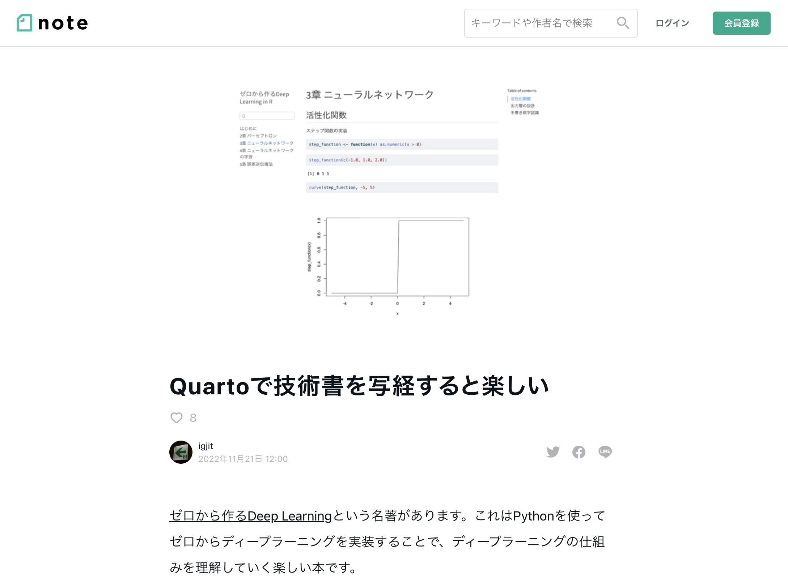

<style type="text/css" rel="stylesheet">
.reveal .text-faint { color: #eee; }
</style>

{width=256}

<a href="https://twitter.com/igjit" class="name">@igjit</a>

- ソフトウェアエンジニア
- [Rで変なものを作る](https://igjit.github.io/slides/)人
- 共著「[Rが生産性を高める](https://gihyo.jp/book/2022/978-4-297-12524-0)」

---

最近読んでる本

---

{width="40%"}

---

<span>ディープラーニングの本格的な入門書。</span>
外部のライブラリに頼らずに、
<span>Python 3によって</span>
ゼロからディープラーニングを作る
<span>ことで、ディープラーニングの原理を楽しく学びます。</span>

<p class="text-small">
<https://www.oreilly.co.jp/books/9784873117584/>
</p>

---

<span class="text-faint">ディープラーニングの本格的な入門書。</span>
外部のライブラリに頼らずに、
<span class="text-faint">Python 3によって</span>
ゼロからディープラーニングを作る
<span class="text-faint">ことで、ディープラーニングの原理を楽しく学びます。</span>

<p class="text-small" style="visibility: hidden;">
<https://www.oreilly.co.jp/books/9784873117584/>
</p>

---

## じゃあRでもできるんじゃね？

---

やってみた。

---

{.img-shadow width="100%"}

<p class="text-small" style="margin-top:0">
<https://igjit.github.io/deep-learning-from-scratch-r/>
</p>

---

6章 学習に関するテクニック

の途中までできた。

---

Q: Rでもゼロからディープラーニングを作れるのか。

---

A: できそう。

---

むしろ

---

Python

```py
import numpy as np

A = np.array([[1, 2], [3, 4]])
B = np.array([[5, 6], [7, 8]])
np.dot(A, B)
```

R

```r
A <- matrix(1:4, 2, byrow = TRUE)
B <- matrix(5:8, 2, byrow = TRUE)
A %*% B
```

---

`import numpy`せずにbaseで行列を計算できるRのほうが
「外部のライブラリに頼らずに」ゼロから作ってると言える。

---

## 気づき

---

### オブジェクトシステム

---

Rではオブジェクトシステムを[選べる](https://adv-r.hadley.nz/oo.html#oop-in-r)

- base R
  - S3
  - S4
  - RC (reference class)
- CRAN package
  - R6
  - R.oo
  - proto

---

どれを使うべきかは解きたい問題と好みによる。

---

私はS3のシンプルさと、それを使った参照透明なコードが好きだけど、

Pythonのミュータブルなオブジェクトを直訳する場合はR6が便利

---

Python

<div style="font-size: 0.7em">
```py
class SimpleNet:
    def __init__(self, W):
        self.W = W

    def predict(self, x):
        return np.dot(x, self.W)
```
</div>

R (R6Class)

<div style="font-size: 0.7em">
```r
SimpleNet <- R6Class("SimpleNet", list(
  W = NULL,
  initialize = function(W) {
    self$W <- W
  },
  predict = function(x) {
    x %*% self$W
  }))
```
</div>

---

だいたい同じように書ける。

---

[Advanced R](https://adv-r.hadley.nz/r6.html)を読めばすぐにR6を使えるようになるよ。

---

### 関数型プログラミング

---

{width=25%}

---

ニューラルネットワークの伝播

つまりひとつ前の値を使って何かする、をくり返す場合

---

元のPythonの[コード](https://github.com/oreilly-japan/deep-learning-from-scratch/blob/master/notebooks/ch06.ipynb)

<div style="font-size: 0.8em">
```py
activations = {}

x = input_data

for i in range(hidden_layer_size):
    if i != 0:
        x = activations[i-1]

    w = np.random.randn(node_num, node_num) * 0.01
    a = np.dot(x, w)
    z = sigmoid(a)

    activations[i] = z
```
</div>

---

[purrr::accumulate](https://purrr.tidyverse.org/reference/accumulate.html)で簡潔に書ける

<div style="font-size: 0.8em">
```r
x1 <- input_data

activations <- purrr::accumulate(
  1:hidden_layer_size,
  function(x, i) {
    w <- matrix(rnorm(node_num * node_num), node_num) * 0.01
    a <- x %*% w
    sigmoid(a)
  },
  .init = x1) %>% tail(-1)
```
</div>

---

配列の初期化、インデックスによるアクセス、条件分岐など、低レベルの処理を書かなくてよくなった。

---

どう計算するか、ではなく、それが何であるか、を記述できる。

---

### 文芸的プログラミング

---


---

ゼロから作るDeep Learning in R は[Quarto](https://quarto.org/)を使って書かれている。

ソースコードは[igjit/deep-learning-from-scratch-r](https://github.com/igjit/deep-learning-from-scratch-r)

---

note書いたので読んでね。

<div class="text-small">
[Quartoで技術書を写経すると楽しい](https://note.com/igjit/n/n989268141be9)
</div>

{.img-shadow width="70%"}

---

## まとめ

---

ゼロから作るDeep LearningをRでやってる

---

技術書の写経楽しい

---

プログラミング楽しい

---

R楽しい

---

みんなも

---

## Enjoy!
